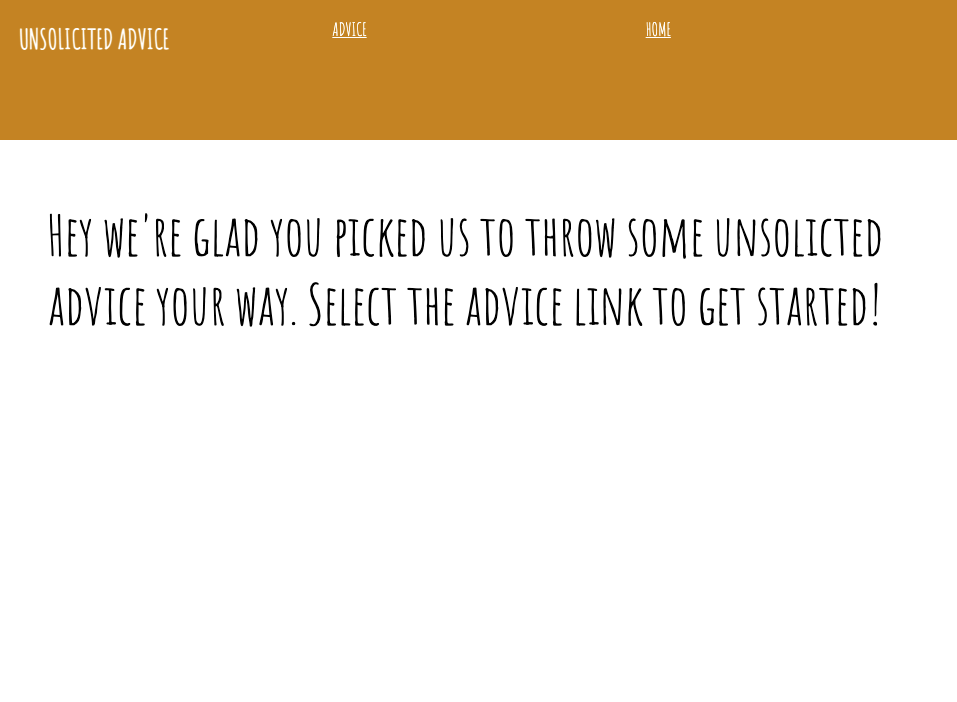
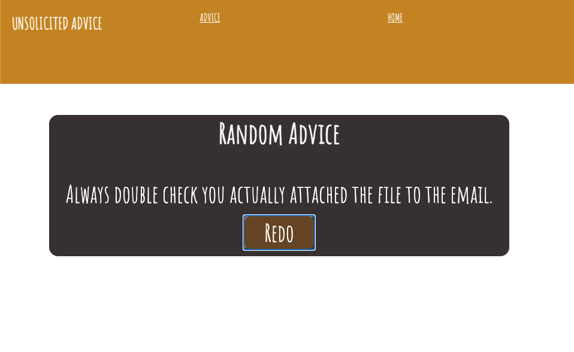
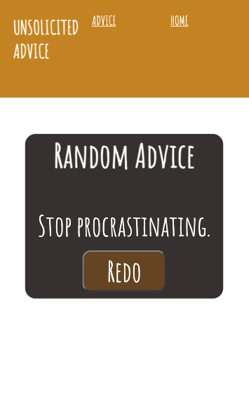
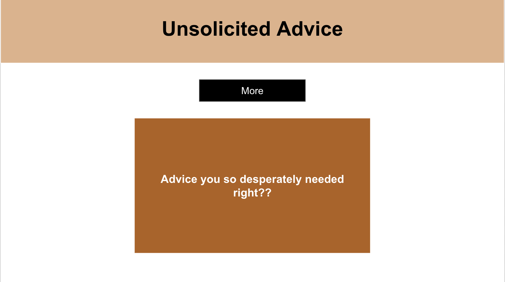

# Project Description
Unsolicited Advice from friends or strangers can get tiresome so why not let my app decide for you? Don't like the advice you get? That's ok, give it another go and find the adice you came for!

## Screenshots of the App

## Technologies Used
React.JS
React Router
## Installation Instructions
Clone/download the repository to your machine. Run npi, open code editor, and run npm start. 
## User Stories
As a site visitor, I want to be able to get unsolicited advice with the click of a button
As a site visitor, I want to be able to receive multiple options in case I don't like my unsolicited advice
## MVP Goals
an API rendering Data app providing the world with much needed Unsolicited Advice with the click of a button
functioning code
mobile & computer friendly
## Wire Frames

<!-- ## Stretch Goals- not met
a favorites tab for when you stumble on actual good advice
generate random meme with random advice
animated design -->